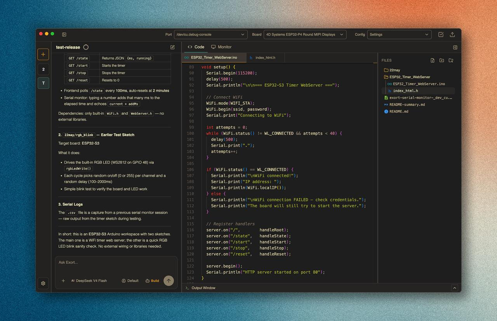
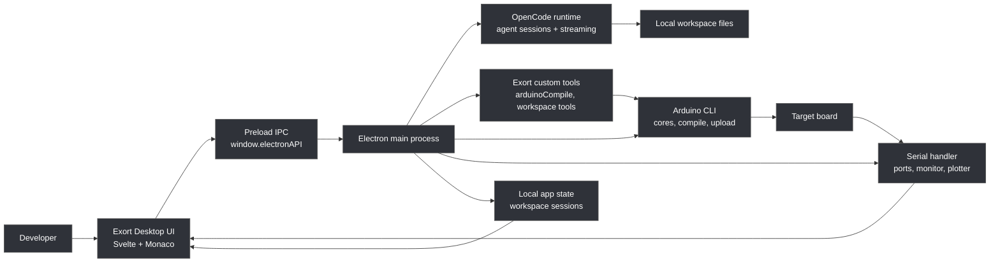

<a href="https://exort.dev">

</a>

[](https://github.com/Razz19/Exort/stargazers) [](https://discord.gg/xmcmcWkr4V) [](https://github.com/sponsors/Razz19)


# Exort


### Free, open-source AI coding workspace for microcontrollers.

Exort is an OpenCode-powered desktop app for embedded development. It provides a local workspace for writing microcontroller code, compiling and uploading projects, and monitoring live serial output on supported boards.

> Start with the included free OpenCode models, or connect your own provider setup for models such as ChatGPT, and other OpenCode-compatible providers.


## Who It Is For

Exort is for you if you are:

- Building Arduino, ESP32, ESP8266, RP2040, STM32, Teensy, or similar microcontroller projects.
- Learning embedded development and want AI help.
- Prototyping firmware that needs fast edit, compile, upload, observe cycles.
- Debugging hardware behavior through serial logs, boot output, sensor streams, or calibration data.
- Using AI coding agents but want the workflow to be all in one.


## Core Features


| Feature | What it does |
| --- | --- |
| AI coding agent | Uses OpenCode to inspect the workspace, explain code, edit files, and help with embedded iteration. |
| Project manager | Opens and switches between local embedded workspaces with persisted state. |
| Board manager | Installs and manages Arduino CLI board platforms and cores. |
| Compile and upload | Automatic and manual compile and upload |
| Serial Monitor | Reads live device output for logs, debug prints, and quick checks. |
| Serial Plotter | Plots numeric serial streams for calibration, sensors, and runtime behavior. |
| Provider connection | Lets you use included free models or bring your own OpenCode-compatible provider setup. |
| Local history | Restores chat history and workspace sessions locally per workspace. |

## How It Works

Exort is a desktop-only Electron app. The renderer UI does not talk to OpenCode, files, serial ports, or Arduino tools directly. It goes through the preload IPC boundary, and the Electron main process owns native capabilities.



## Requirements

For the desktop app (can install both in the app settings)
- Arduino CLI for board package, compile, and upload flows. Exort can check and help install requirements from the desktop package scripts.
- OpenCode runtime/provider configuration. Exort includes a managed OpenCode path and supports bring-your-own provider setup.

For running from source:

- Node.js 20 or newer.
- npm 10 or newer.
- Git.
- Platform build tools required by Electron/native Node dependencies on your OS.

Check local desktop requirements:

```bash
npm --workspace @exort/desktop run requirements:status
```


## Getting Started


Download the latest build from [exort.dev](https://exort.dev) or [Github releases](https://github.com/Razz19/Exort/releases).

or 

### Run from source

```bash
git clone https://github.com/Razz19/Exort.git
cd Exort
npm install
npm run dev
```

Package-level commands:

```bash
npm run dev --workspace @exort/desktop
npm run build --workspace @exort/desktop
npm run typecheck --workspace @exort/desktop
```

## Recommended Workflow

1. Open a local workspace (folder).
2. Use the included free models or connect your provider.
3. Ask Exort Agent to create or inspect the project, explain code, or make a change.
4. Review edits in the editor.
5. Select the target board and serial port.
6. Compile and upload.
7. Watch logs in Serial Monitor or graph values in Serial Plotter.
8. Iterate!

## Supported Boards

Exort works with Arduino CLI board platforms, including:

- Arduino
- ESP32
- ESP8266
- RP2040
- STM32
- Teensy
- Other Arduino CLI-compatible cores

Actual compile/upload support depends on the board core, toolchain, USB driver, and upload protocol installed on your machine.


## Community

- Website: [exort.dev](https://exort.dev)
- GitHub: [Razz19/Exort](https://github.com/Razz19/Exort)
- Discord: [Join the community](https://discord.gg/xmcmcWkr4V)
- Support: [GitHub Sponsors](https://github.com/sponsors/Razz19)

## License

Exort is licensed under `AGPL-3.0-only`. See [LICENSE](LICENSE).
